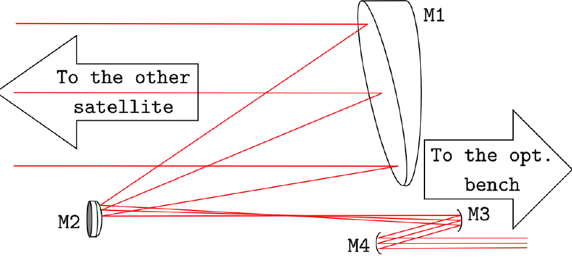
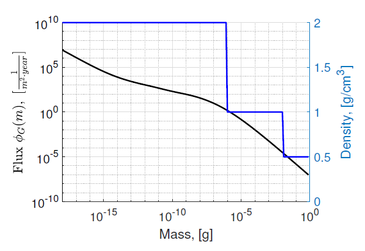
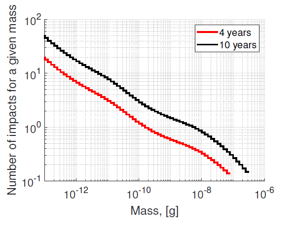
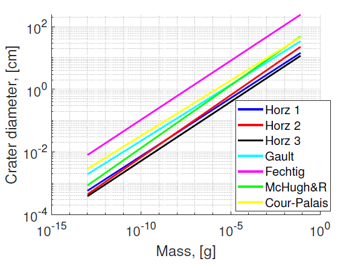
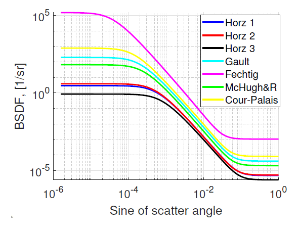

# 1 导论

在这一章节中，我将简要回顾一下引力波、引力波搜索以及它们的发现的历史（见1.1节）。引力波是由大型物体的加速运动所产生的时空涟漪。我将证明利用自由落体质量和光学干涉法来检测引力波的可能性。一个可能使用这一概念进行引力波探测的仪器是LISA（激光干涉引力波太空天线，见1.2节）。在这里，我将描述该任务的科学目标，给出一个总体设计概述，并说明对LISA任务进行杂散光研究的动机（见1.2节）。

## 1.1 引力波

引力波的预测来自我们这个时代最著名的物理学家——阿尔伯特·爱因斯坦[11]。他认识到，当他将狭义相对论应用于力学和电动力学后，发现牛顿的引力理论也需要改变。在相对论物理学中，因果律不允许任何信号以超光速进行传播。描述引力相互作用的新理论称为广义相对论（GTR）。在其创立之后不久，广义相对论就被用来解释水星近日点的进动。1919年，爱丁顿验证了太阳的引力会弯曲星光的预言。直到20世纪60年代，通过观测才确认，处于引力位势深处的时钟在外部观察者看来似乎运行得更慢。

爱因斯坦在1916年使用弱场近似来预测引力波，然后在1918年得出了正确的数学表达。他展示了引力波在其理论中存在的可能性，并指出加速质量分布系统会因引力波的辐射而失去能量。20世纪60年代开始了对引力波的实验搜索，但直到2015年才达到了所需的灵敏度水平。在我深入介绍干涉引力波探测器的理论之前，我想先介绍引力波检测的物理原理[48].

### 1.1.1 引力波的传播

在狭义相对论中，时空间隔 $\mathrm{d}s$ 为：

$$
\mathrm{d}s^2
=\eta_{\mu \nu} \mathrm{d}x^\mu \mathrm{d}x^\nu 
$$

其中，$\eta_{\mu \nu}$ 是闵可夫斯基度规：

$$
\eta_{\mu \nu}
=\begin{pmatrix}
1&&& \\
&-1&& \\
&&-1 \\
&&& -1
\end{pmatrix}
$$

在广义相对论中，时空不再是平直的，而是弯曲的，以表现所谓的引力：

$$
\mathrm{d}s^2
=g_{\mu \nu} \mathrm{d}x^\mu \mathrm{d}x^\nu
$$

其中，$g_{\mu \nu} $ 包含了所有关于时空弯曲的信息。假设时空中有一微小扰动，，于是我们可以将度规重写为以下形式：

$$
g_{\mu \nu}
=\eta_{\mu \nu}+h_{\mu \nu}
$$

其中，$h_{\mu \nu} $ 是对闵可夫斯基度规的微小偏移。

在后文中，我们将使用横向无迹规范，在这种规范下，自由下落的试探质量的世界线（根据定义，这些物体除引力外不受任何其他影响）划定了坐标系。在弱场极限下，并利用这些坐标，爱因斯坦场方程变成了波动方程：

$$
\bigg( \nabla^2-\frac{1}{c^2}\frac{\partial^2}{\partial t^2}\bigg) h_{\mu \nu}
=0
$$

其解为 $h_{\mu\nu}=h(\omega t-\vec{k}\cdot\vec{x}) $，其中，$\frac{\omega}{2\pi} $ 是引力波的频率，$\vec{k} $ 是引力波的波矢。同时要指出，引力波有两个偏振方向，通常用 $h_{+} $ 和 $h_{\times} $ 表示。

在这些坐标系中，引力不是一种力，而是通过弯曲时空的测地线运动。因此，当引力波穿过自由下落的物体时，它们不会被加速，因此可以用于理解时空的坐标系。

接下来的步骤是研究度规的变化如何影响自由下落质量之间的可测距离。

### 1.1.2 引力波的测量原理

让我们考虑沿 $x_1$ 方向传播的单一偏振状态的平面引力波：

$$
\eta_{\mu \nu}
=\begin{pmatrix}
0&&& \\
&0&& \\
&&h(kx_1-\omega t) & \\
&&&-h(kx_1-\omega t)
\end{pmatrix}
$$

两个相邻事件的时空间隔由下式给出：

$$
\begin{aligned}
\mathrm{d}s^2
&=g_{\mu\nu}\mathrm{d}x^\mu\mathrm{d}x^\nu \\
&=c^2\mathrm{d}t^2-\mathrm{d}x_1^2-(1+h(kx_1-\omega t))\mathrm{d}x_2^2-(1-h(kx_1-\omega t))\mathrm{d}x_3^2
\end{aligned}
$$

让我们在 $x_2=-\frac{L}{2} $ 处放置一个自由运动的质量（光发射器），在 $x_2=\frac{L}{2} $ 处也放置一个自由运动的质量（接收器）。对于在两个质点之间传播的光，我们可以写出总间隔：

$$
\mathrm{d}s^2
=0
=c^2\mathrm{d}t^2-(1+h(kx_1-\omega t))\mathrm{d}x_2^2
$$

这里用到了“光速在任何惯性参考系内均为 $c$” 这一结论。

上式可以重写为：

$$
c\mathrm{d}t
=\sqrt{1+h(kx_1-\omega t)}\mathrm{d}x_2
$$

当 $h\ll 1$，有：

$$
c\mathrm{d}t
=[1+\frac{1}{2}h(kx_1-\omega t)]\mathrm{d}x_2
$$

若光传播时间 $\tau$ 远小于引力波的周期，积分就很简单：

$$
\tau
=\bigg( 1-\frac{1}{2}h(t) \bigg) \frac{L}{c}
$$

若 $h=0$，则 $\tau=\frac{L}{c} $，然而，由于引力波的存在，$\tau $ 的变化为：

$$
\delta \tau
=h(t)\frac{L}{2c}
$$

对于光学相位测量，其相移为：

$$
\Delta \phi
=\frac{2\pi c}{\lambda}\delta\tau
=\frac{\pi L}{\lambda}h(t)
$$

其中，$\lambda$ 是用于探测引力波的光学信号的波长。光学干涉测量是最适合测量两个探测质量之间传播时间的方法，因此也是最适合探测引力波的方法。

## 1.2 激光干涉仪太空天线

激光干涉引力波天文台(Laser Interferometer Space Antenna，LISA)将成为第一个太空引力波观测站[37]。自阿尔伯特·爱因斯坦在[11]中提出引力波存在的理论以来，直到2015年美国地面干涉仪LIGO[1]首次观测到引力波（获得2017年诺贝尔奖）已经过去了99年。由于地震噪声、引力梯度噪声和其他影响，地面干涉仪（如LIGO、Virgo）在低频段受到限制。通过在稳定的岩石板上建造地下干涉仪（爱因斯坦望远镜），可以实现显著改进[12]。然而，即使是地下探测器也将受限于观测总质量为几百个太阳质量的黑洞。对于数千个太阳质量的黑洞，地面探测将是不可能的。要在较低频率检测引力波，并且检测更大质量和较慢运动的物体，探测器必须部署在太空中，很可能是LISA等太空干涉仪任务。LISA的频带（0.1mHz至100mHz）将包括由银河核心超大质量黑洞捕获的紧凑天体、我们银河系内外的紧凑双星系统、双重超大质量黑洞以及早期宇宙量子波动产生的引力波[37]。其科学目标是通过观测测试广义相对论，探索新物理与宇宙学，研究银河核心中的恒星群体和动力学，调查紧凑恒星质量双星系统，以及研究银河系的结构。LISA还能追踪巨大黑洞的形成、增长和合并历史[37]。

LISA是一个引力波观测太空任务，目前处于A阶段。它由三颗相同的卫星组成（见图1.1），形成一个边长为 L=2.5 百万公里的等边三角形。该星座将被放置在绕太阳的轨道上，并以 20 度间隔跟随地球。在开始数据采集时刻，地球和星座之间的距离为 5000 万公里。随着时间的推移，星座将远离地球，到达 10 年数据采集结束时，距离将达到约 6500 万公里。每颗航天器将包含两个移动光学子系统（MOSA），这些系统将指向遥远的卫星。每个 MOSA 包括一个望远镜、光学平台、测试质量，并接收来自频率受控激光束的信号。每颗卫星上的两个 MOSA 通过光纤连接，以提供两个光学局部振荡器的交叉参考（图1.1 中的绿色曲线）。三角形的每条臂都形成一个双迈克尔逊类干涉仪，其中测试质量定义了臂的端点。

为了消除光压和太阳风等非引力来源的影响，每颗航天器都被设计成零阻力卫星。测试质量在航天器内部自由下落（指向远处的卫星），而航天器则围绕其旋转并吸收所有本地非引力力。此外，电容传感器确定了相对于航天器的测试质量（TM）的位置，然后将信息发送到无阻力姿态控制系统（DFACS），以控制和维持航天器围绕 TM 的位置。这项技术已经通过 LISA Pathfinder 任务进行了验证[3]。

连续测量两个测试质量之间光程长度 $L[1 + h(t)]$ 可以揭示引力波 $h(t)$ 的存在。这是通过每条三角臂末端的六次干涉异频相位测量（总共）来完成的。在存在未经意图的光线（杂散光）时，异频干涉可能会受到干扰。正确评估杂散光以及仪器的稳定性对于 LISA 测量至关重要，因为其旨在实现对引力波 $h(t)$ 应变达到 $10^-21$ 的精度，即测量光程长度 $L[1 + h(t)]$ 的分数变化。

## 1.3 论文在 LISA 任务背景下的地位

对LISA仪器的所有噪声源进行仔细考虑是至关重要的一步。在干涉式引力波（GW）测量中，杂散光是最重要的噪声贡献之一[37]。传统的消除杂散光的方法在第2章中有所讨论，并且适用于大多数使用非相干光的应用，比如成像或光收集。然而，在异频测量中，相干散射光是一个更复杂的问题。干扰由于散射光造成的变化显示出强烈的依赖性，诸如光程差、入射角度、环境温度以及激光波长等不同参数。因此，需要进行有关散射光的研究，包括实验和模拟，以理解散射光对干涉仪读数的影响。在这项论文工作期间，我为相干背向散射测量建立了两个同相位干涉设置，通过观察到斑纹特性在所有类型的测量中都是普遍存在的，来确认这些属性可以在随机phasor sum的经典方法下得到。

## 1.4 论文内容

在第2章中，我将描述LISA异频测量的进行方式以及它们如何受到杂散光的干扰。我将讨论潜在的来源（微粗糙度、污染等）、散射光描述的关键参数和主要的缓解策略。特别关注于污染和颗粒计数作为最主要的杂散光来源之一。在第8章，我设计并建立了一个基于物联网（IoT）概念的洁净室污染控制系统，以测试使用通用颗粒计数器进行洁净室应用的想法。

在我的研究中，我使用了传统方法来研究LISA中的杂散光，同时也开发了新的技术。例如，在第3章，我使用了传统方法，但是用于一个新的应用。在该章节中，我估计了微流星撞击引起的杂散光贡献。另一方面，相干散射具有许多独特的特性（见第4章），因此需要采用新的方法。为了研究这个问题，我建立了两个分别用于波长为1.55μm和1.06μm的设置，用于研究光学表面的相干散射。为了解释由于微粗糙度导致的散射的实验结果，我开发了一个数值模型（见第4章）。这个模型与广泛使用的模型一致，但更重要的是，它可以正确描述斑纹行为并解释实验结果。

在1.55μm处的实验设置（见第5章）是首次演示的方法。它展示了在-125dB水平下进行背向散射测量的可能性，而这在没有为该设置专门开发的信号处理算法的情况下是不可能的。我展示了在干涉测量中存在斑点，并且当目标移动时会发生变化，并且它依赖于光束的属性。在1.06μm处的另一个设置（见第6章）定性地确认了所达到的结果。它代表了LISA，因为它与LISA使用相同的波长，并且也执行干涉测量。该设置展示了在10^-5 1/sr水平下测量BRDF的可能性，这是现代最先进的BRDF仪器的水平。

LISA中的散射也会发生在光纤中，它将连接两个MOSA。在第7章中，我提出了一种光纤中相干背向散射的模型。其目标是展示斑点在这种散射中的存在，并且借助我的模型，我能够分析实验数据、证明分析，并提出改进建议。

我构建的设置被用于从污染物中进行相干背向散射的测量（见第8章）。为此，我将测得的背向散射信号与米氏理论进行了比较。为了计算表面上的球体数量，我开发了图像处理算法。

总之，这项研究达到了对干涉装置中相干散射现象的理解，并在第9章中对其进行了总结。

# 2 杂散光

如在第1章中讨论的，引力波信号编码在干涉信号的相位中。LISA仪器将进行异频干涉相位测量（见2.1节）。这些测量可能会受到杂散光的干扰（见2.2节）。

在光学仪器中，杂散光被认为是任何未在设计中预期的光线。LISA中的杂散光包括重影、光束的衍射、外部贡献（星光）和散射。杂散光来源的完整列表将在2.3节中给出。

本论文主要集中在研究由散射引起的杂散光。在第2.4节，我将介绍散射光描述的关键概念——双向散射分布函数（BSDF）。我还将解释表面微粗糙度与BSDF之间的联系。另一个重要的散射源是污染，这将在2.5节中讨论。在该节中，我将概述污染的分类和来源、传输方法、光学效应以及预防/缓解策略。特别关注将专门放在污染颗粒计数上（见2.5.2节）。

在第2.6节中，我将讨论LISA仪器中杂散光的可能缓解策略。在整个章节中，我将强调我对这些研究的贡献。

## 2.1 LISA激光干涉异频相位测量

LISA仪器中的相位测量将采用异频检波方案。异频意味着干涉测量中涉及的两束光具有光学频率的偏移。这种偏移在时间上并不是恒定的，在LISA的情况下，它在5-25 MHz范围内缓慢变化。关于异频测量的所有优势和必要性的讨论超出了本文的范围[19]，但其中一个原因将在第2.2节中进行阐述。然而，在第2.2节中，我将描述它对杂散光抑制的积极影响。

为了说明异频干涉测量的原理，让我们假设两束光，振幅为 $a_i$，初相位为 $\phi_i$，光学频率为 $\Omega_i$，叠加在检测器表面上。在这种情况下，每束光的复振幅为

$$
B_i
=a_ie^{\mathrm{j}\phi_i+\mathrm{j}\Omega_i t}
$$

这两束光叠加后的光强为：

$$
\begin{aligned}
I
&=|a_1e^{\mathrm{j}\phi_1+\mathrm{j}\Omega_1 t}+a_2e^{\mathrm{j}\phi_2+\mathrm{j}\Omega_2 t} | \\
&=a_1^2+a_2^2+2a_1a_2\cos\bigg[ (\Omega_1-\Omega_2 )t+(\phi_1-\phi_2) \bigg] \\
&=(a_1^2+a_2^2)\bigg( 1+\frac{2a_1a_2}{a_1^2+a_2^2}\cos(\Omega t+\Delta \phi) \bigg) \\
&=J[1+C\cos(\Omega t+\Delta \phi)] 
\end{aligned}
$$

其中，$J=(a_1^2+a_2^2)$ 是平均光强，$C$ 是常数。干涉图样会随时间变化，但振荡的频率为 $\frac{\Omega }{2\pi} $，其中，$\Omega=\Omega_1-\Omega_2$；光程差 $\Delta L$ 包含在相位差之中：

$$
\Delta\phi
=\phi_1-\phi_2
=\frac{2\pi}{\lambda}\Delta L
$$

光电二极管的电流与入射到其表面 $S$ 上的光功率成正比，该功率是上述光强在 $S$ 上的积分：

$$
P
=\int\limits_{S} I\mathrm{d}x\mathrm{d}y
=\bar{P}[1+C\cos(\Omega t+\Delta \phi)]
$$

其中，$\bar{P}$ 是入射到光电二极管表面上的平均功率，$C$ 是某个常数

光电二极管电流通过转阻放大器转换为电压。为了从测量信号中提取相位，使用LISA位相计。其基本原理基于锁相检测。为此，测得的信号 $2A\cos(\Omega t + \Delta \phi)$ 与相同频率的参考信号 $\cos(\Omega t)$进行相乘：

$$
2A\cos(\Omega t+\Delta \phi)\times\cos(\Omega t)
=A\cos(\Delta \phi)+A\cos(2\Omega t-\Delta\phi)
$$

低通滤波器滤除频率为 $2\Omega$ 的高通分量。滤波的结果是得到了同相分量：

$$
I
=A\cos(\Delta \phi)
$$

对于参考信号，采用90度的相位偏移进行相同的处理。在这种情况下，解调的结果是正交分量：

$$
Q
=A\sin(\Delta \phi)
$$

同相和正交分量的组合提供了干涉信号的相位：

$$
\Delta \phi
=\arg(I+\mathrm{j}Q)
$$

图6.3展示了卫星-卫星（“长臂”）LISA外差干涉测量的更详细的图示。一个强大的光束（1.5W），称为“发送”光束或Tx光束，被发送到望远镜（图6.3中的粗红线），然后传输到远程卫星。与此同时，同一个望远镜接收远程卫星发射的光频移的远低功率光束并呈正交极化（细蓝线）。这个光束被称为“接收光束”或Rx光束。极化分光镜（PBS）被安装以避免混合两种不同极化的光束。被发送光束的一小部分（0.2%）被挤出来创建参考光束。这个光束和接收光束（经过 $\lambda/2 $ 偏振片将极化转动90度）在双象限光电二极管处干涉。测得的信号被放大、解调和由相位计进行分析。相位 $\phi$ 包含了关于引力波的信息。

## 2.2 LISA中的杂散光

在存在杂散光的情况下，相位测量可能会受到干扰。杂散光是一束额外的光（图6.3中的虚线），它可以扰乱外差测量，假设它具有与外差干涉的两个标称光束之一相同的极化和波长。因此，即使系统中存在许多杂散光源，由于信号超出了检测范围，它们通常会被外差相位计消除。这些属性的主要参数是两个干涉光束之间的光学频率差 $\frac{\Omega}{2\pi} $ ，其中 $\Omega=\Omega_1-\Omega_2$ 。解调是以频率 $\frac{\Omega}{2\pi} $ 进行的，因此只有在这种情况下，才会测量拍频干涉信号的相位。第二个属性与系统中的极化分布有关。为了使干涉成像成为可能，到达光电二极管的两个光束应该具有适当的极化。然而，发送和接收光束的极化是交叉的。偏振分光镜高度抑制了相同极化的Tx光束的散射，并将 $\frac{\lambda}{2} $ 板将极化矢量旋转到直线方向（见图6.3）。这两个因素的组合大大减少了仪器对杂散光的依赖性。

让我们更仔细地研究一下LISA仪器的杂散光抑制特性。为此，让我们建立一个简单的模型，并列出系统中所有可能的干涉，发现哪些干涉会影响测量。模型中考虑的所有光束如下所示：

- 光学台上的发送光束 $B_{T_x}^B(\Omega_1) $

- 直线偏振的杂散发送光束 $B_{T_xS}^B(\Omega_1) $

- 交叉极化的接收光束 $B_{R_x}(\Omega_2)$

- 交叉极化的杂散接收光束 $B_{R_xS}(\Omega_2)$

- 交叉极化的杂散发送光束 $B_{T_xS}(\Omega_1) $

对于参考极化，我采用了参考光束（干涉仪中的“本地振荡器”光束）的极化。交叉极化意味着极化矢量相对于参考极化旋转了90度。杂散发射光束的交叉极化不仅可能是由于散射过程，还可能由于在散射之前对传输光束的极化矢量（例如在PBS中）进行了旋转。我忽略了杂散发送光束对光学台可能造成的系统扰动的影响，因为这个BBTxS(1)光束并没有直接到达光电二极管。

收到的光束BRx（2）和两个杂散光束（BRxS（2），BTxS（1））的极化矢量在抵达重组光束分束器之前被一个角度为π/2的板旋转90度（见图6.3）。因此，所有光束以对齐的直线极化到达光电二极管。另外，我在这里考虑在光电二极管表面交叉极化方向上的干涉贡献幅度是可以忽略不计的。

光电二极管上的强度（在半波板将接收到的光束极化旋转以使其与参考光束极化平行后）是所有叠加光束的幅值平方的和：

$$
I
=|B_{T_x}^B(\Omega_1)+B_{T_xS}^B(\Omega_1)+B_{R_x}(\Omega_2)+B_{R_xS}(\Omega_2)+B_{T_xS}(\Omega_1) |^2
$$

干涉强度的（交流）变化部分是：

$$
\begin{aligned}
I_{AC}
=&B_{T_x}^B B_{T_xS}^B\cos(\phi_1)+ &\green{[1]} \\
&B_{T_x}^B B_{R_x}\cos(\Omega t+\phi_2)+ &\blue{[2]} \\
&B_{T_x}^B B_{R_xS}\cos(\Omega t+\phi_3)+ &\red{[3]} \\
&B_{T_x}^B B_{T_xS}\cos(\phi_4)+ &\green{[4]} \\
&B_{T_xS}^B B_{R_x}\cos(\Omega t+\phi_5)+ &\red{[5]} \\
&B_{T_xS}^B B_{R_x}\cos(\Omega t+\phi_6)+ &\red{[6]} \\
&B_{T_xS}^B B_{T_xS}\cos(\phi_7)+ &\green{[7]} \\
&B_{R_x}^B B_{R_xS}\cos(\phi_8)+ &\green{[8]} \\
&B_{R_x}^B B_{T_xS}\cos(\Omega t+\phi_9)+ &\red{[9]} \\
&B_{R_xS}^B B_{T_xS}\cos(\Omega t+\phi_{10})+ &\red{[10]} \\
\end{aligned}
$$

根据这个方程，很明显1、4、7、8项（绿色）不会对信号产生影响，因为它们的拍频不是 $\Omega$.。第2项（蓝色）是名义上的项。它代表了接收光束和Tx光束的干涉。只有3、5、6、9、10项（红色）会对相位测量的扰动产生影响。每个贡献都有其光学路径差相位 $\phi_x$ ，它是两束光的相位差。如果这个相位是稳定的，相位计将看到一个恒定的偏移，这不会影响LISA测量。然而，由于望远镜的指向和光学元件的热振动运动，相位偏移可能会发生变化。这将导致相位测量中的噪声，因此至关重要的是使用高度热稳定的材料（如Zerodur）制造仪器组件和光学系统。望远镜和光学台架的温度稳定性是减轻LISA测量中杂散光耦合后果的不同方法之一。

平衡检测[19]也可以减少杂散光的影响。为此，在重组光束分束器的两个输出上的两个光电二极管的信号进行相减。这会抑制共同的杂散光信号。

基本上，杂散光分析包括研究杂散光的不同特性：

- 达到光电二极管的杂散光场的幅度（更准确地说是分数幅度）；

- 杂散光和名义光之间相位差的噪声。

- 杂散光的极化（相对于名义极化）；

- 杂散光场与名义光束模式之间的重叠（将在4.1.2节中考虑）。

这项研究可以通过实验或模拟进行。使用方程2.10，可以确定哪种贡献占主导地位。这一结果应该纳入关于杂散光对LISA测量影响的总体模型中，但在论文中不会被使用。

### 杂散光与相位耦合

另一种处理杂散光的方法（见参考文献[24]）是考虑名义光束和杂散光贡献的相量和。我们在复平面上考虑对应于两束光的相量。如果我们假设杂散光场很小，并且只对名义光产生轻微扰动，则矢量和的泰勒展开允许我们得到一个关于杂散光与外差相位扰动之间联系的方便表达式。在分数杂散光幅度 epsilon 的一阶情况下，我们得到：

$$
\Phi
\approx \varepsilon\cdot\sin\phi
$$

这里的 $\varepsilon$ 是杂散光场幅度相对于名义光的分数，而 $\phi$ 是杂散光和名义光之间的相位差（见图2.2）。

我将使用这种方法来推导在相干散射研究中的统计性质（见4.2节）。

## 2.3 LISA中杂散光的潜在来源

LISA仪器的杂散光包括多种现象，可分为四类：天体杂散光（这种杂散光是不相干的）、鬼光、衍射和散射。幽灵光束是一种寄生光束，产生于：

- 在镜子的前侧，反射应该是全反射的，但是会有一小部分功率被传输；

- 在分束器的背面：由于防反射涂层不完美或由于分子污染引起的反射；

- 孔径处的反射。

在LISA仪器中，鬼光不仅出现在光学台架上，也出现在望远镜中。具有略微错误极化的光束也可以被视为鬼光。

LISA仪器中的多个孔径将限制光束尺寸。这会引起不期望的衍射效应和杂散光。

天体源的杂散光影响（太阳、行星、恒星）已在参考文献[7]中对构型获取传感器（CAS）进行了分析。CAS系统是用来寻找遥远卫星的光线。该研究得出结论说，在正常操作期间，天体源不太可能对CAS产生扰动效果。

在LISA仪器中，散射是杂散光的最重要贡献因素之一。散射的起源是一系列现象：微粗糙度、污染、外观缺陷（凹痕、划痕、微米流星损伤）以及介质内部的散射（光纤内部、透镜内部等）。

最近使用FRED和Zemax光学软件进行了有关LISA望远镜散射问题的计算[41]。 散射不仅对干涉仪有影响，对CAS也有影响。相干散射可能使卫星的指向成为不可能。在阿尔伯特·爱因斯坦研究所（AEI）进行了光纤散射的研究[21]。

本论文主要专注于杂散光中的散射方面。论文提供了广泛的散射源研究：微小流星体（第3章）、微粗糙度（第4、5、6章）、污染（第8章）、光纤回波散射（第7章）。

## 2.4 散射光描述的关键参数

散射光描述中的核心概念是双向散射分布函数（BSDF）。但在介绍它之前，我想提醒读者一些基本的辐射度量。

流量（功率）$\mathrm{d}\Phi $ 是每秒钟的光子数量。辐照度 $E $ 是接收到的单位面积 $\mathrm{d}A $ 的辐射通量 $\mathrm{d}\Phi $：

$$
E
=\frac{\mathrm{d}\Phi}{\mathrm{d}A}
$$

辐照度用于描述表面的照明（见图2.3a）。辐亮度 $L$（见图2.3b）是表面通过投影面积 $\mathrm{d} A\cos(θ)$ 每个微分立体角 $\mathrm{d}\Omega $ 发射、反射或透射的通量 $\mathrm{d}^2\Omega $：

$$
L
=\frac{\mathrm{d}^2\Phi}{\mathrm{d}A\cos(\theta)\mathrm{d}\Omega}
$$

其中，$\theta $ 是相对于表面法线的发射角（球坐标中的极角），$\Omega $ 是一个收集立体角。对于发射角 $\theta $ 而言，辐亮度保持恒定的表面被称为 Lambertian 表面。

利用这些量，我们可以确定双向散射分布函数（BSDF），即散射表面的辐亮度与入射表面的辐照度之比。

$$
\mathrm{BSDF}(\theta_i,\phi_i,\theta_s,\phi_s)
=\frac{\mathrm{d}L(\theta_i,\phi_i,\theta_s,\phi_s)}{\mathrm{d}E(\theta_i,\phi_i)}
$$

其中指下表 $i$ 表示入射方向，下标 $s$ 表示散射方向。$\phi$ 是球坐标中的方位角，$\mathrm{d}\Omega_s $ 是散射立体角。或者用其他术语来说：

$$
\begin{aligned}
\mathrm{BSDF}
=\frac{\mathrm{d}\Phi_s/\mathrm{d}\Omega_s}{(\mathrm{d}\Phi_i)\cos\theta_s}
\end{aligned}
$$

根据透射率或反射率的不同，BSDF 分为双向透射分布函数（BTDF）和双向反射分布函数（BRDF）。在接下来的章节中，我将主要使用 BRDF。

常用的量是角分辨散射，基本上是 $\mathrm{BRDF(\theta_s, \phi_s)} \times \cos θ_s$。另一个广泛使用的量是总积分散射（TIS）：

$$
\mathrm{TIS}
=\int_{0}^{2\pi}\int_{0}^{\frac{\pi}{2}}\mathrm{BSDF}\sin\theta_s\cos\theta_s\mathrm{d}\phi\mathrm{d}\theta_s
$$

对于兰伯特散射体，$\mathrm{BSDF = TIS}/\pi$ 。TIS 是一种易于测量的量，因为只需要光源、积分球和探测器即可进行测量。而在进行 BRDF 测量时，则需要特殊的仪器设备进行同步检测以及精确的旋转机制来进行探测。在测量高质量、微弱散射光学元件的 BRDF 时，可能需要在探测器尺寸（较大尺寸表示更多光通量）和角分辨率之间做出权衡。当散射很弱时（低污染水平、正在测试的超抛光表面），使用这种方法进行测量会变得复杂甚至不可行。在第 5 章和第 6 章中，我将描述一种用于光学表面背向散射测量的最新干涉装置，它是为了本论文中所呈现的研究而构建的。

在模拟散射特性时，每种散射源都分别处理，并由其 BSDF 描述（对应的最常用模型名称在括号中）：

表面微粗糙（ABC，Harvey-Shack，ABg）；

颗粒污染（Mie，Spyak & Wolfe（Lallo & Petro），Dittman）；

外观缺陷：凹痕，划痕（Peterson）

总散射是所有贡献者的 BSDF 之和。在第 4 章中，我将使用 Harvey-Shack 理论来验证我的数值模型。在第 3 章中，我将使用 Peterson 模型来估计由微流星损伤引起的散射，在第 8 章中，我将使用 Mie 理论与实验结果进行比较。

### 2.4.1 由于微粗糙度而产生的散射

由于微观粗糙度引起的光学表面散射很容易描述。它是由于反射波前中的相位波动引起的（见图 2.4）。如果表面高度波动 $z(x,y)$ 与波长相比较小，则相位波动可以近似表示[5]：

$$
P_{\mathrm{surf}}(x,y)
=\exp\bigg( \mathrm{j}\frac{4\pi}{\lambda}\cos(\theta_i)z(x,y) \bigg)
\approx 1+\mathrm{j}\frac{4\pi}{\lambda}\cos(\theta_i)z(x,y)
$$

对于光学质量表面，两项展开就足以描述在镜面核外的散射。第二项负责由于微粗糙而导致的散射。

在这种情况下，光学表面被视为图形轮廓和表面粗糙度轮廓 $z(x,y)$ 的总和。图形轮廓决定成像特性，表面粗糙度轮廓则决定了从中散射出的光的幅度和角分布 [16]。图形轮廓还包括像差。像差介于反射和散射之间，因为它并不导致散射，但也不是名义上的。

#### 粗糙表面的 $\mathrm{BSDF}$

摄动（Rayleigh-Rice）理论表明，在弱散射极限下，粗糙表面可以被理解为一组衍射光栅。该理论声称在小粗糙度 ($\ll \lambda$) 的情况下可以确定功率谱密度（PSD）与双向散射分布函数（BSDF）之间的关系（"黄金法则"）。

$$
\mathrm{BSDF}(\theta_i;\theta_s,\phi_s)
=\frac{4\pi^2\Delta n^2}{\lambda^4}\cos(\theta_i)\cos(\theta_s)QS_2(f_x,f_y)
$$

其中，$\Delta n$ 表示散射表面边界处的折射率差（对于镜面来说等于2），而 $Q$ 是极化因子，大致等于表面的镜面反射或透射率。$S_2(f_x, f_y)$ 是粗糙表面的功率谱密度，在本节后面将进行讨论。

表面微粗糙度最常用的双向散射分布函数（BSDF）模型是 K-correlation (ABC)、ABg 和 Harvey-Shack 模型。在 K-correlation 模型中，BSDF 为：

$$
\mathrm{BSDF}(|\sin\theta_s-\sin\theta_i|)
=\frac{4\pi^2 \Delta n^2}{\lambda^4}\cos(\theta_i)\cos(\theta_s)Q\times A[1+(Bf)^2]^{-\frac{C}{2}}
$$

其中，系数 $A,B,C$ 将在下章讨论。在 3 参数的 Harvey-Shack 模型中，BSDF 为：

$$
\mathrm{BSDF}(|\sin\theta_s-\sin\theta_i|)
=b_0\bigg[ 1+\bigg( \frac{|\sin\theta_s-\sin\theta_i|}{l} \bigg)^2  \bigg]^{\frac{s}{2}} 
$$

其中，系数 $b_0$ 定义了接近正向方向的散射水平，参数 $l$ 设置了功率谱密度中“拐点”的位置，而 $s$ 则代表其高频部分的斜率。

ABg 模型类似于 Harvey-Shack 模型：

$$
\mathrm{BSDF}
=\frac{A}{B+|\sin\theta_s-\sin\theta_i|^g}
$$

系数 A、B 和 g 可以从 Harvey-Shack 的系数中计算得出[16]。

所有这些模型的目标都是正确描述散射，因此它们都能很好地逼近表面粗糙度的功率谱密度，所以无论选择哪种模型都可以。因此，只需要三个参数来描述表面的散射，这很方便。其中一些参数可以根据光学制造数据计算得出，而其他参数则取决于抛光类型并可以进行预测。这些参数的来源将在下一节中讨论。

#### 粗糙度表征

表面粗糙度轮廓的功率谱密度（PSD）为：

$$
S_2(f_x,f_y)
=\lim_{L\to +\infty} \frac{1}{L^2}\bigg|\int_{\frac{-L}{2}}^{\frac{L}{2}}\int_{\frac{-L}{2}}^{\frac{L}{2}} z(x,y)\exp[-2\pi\mathrm{j}(f_x x+f_y y)]\mathrm{d}x\mathrm{d}y \bigg|^2
$$

其中，$L$ 是测量轮廓的尺寸，$f_x,f_y$ 分别表示空间频率。

当粗糙度显著低于 $\lambda / (4 \pi)$（光学质量表面）时，表面粗糙度的功率谱密度可以用这种类型的曲线来近似：

$$
S(f)
=A[1+(Bf)^2]^{-\frac{C}{2}}
$$

其中，$A,B,C$ 是模型参数，频率为 $f=(f_x^2+f_y^2)^{\frac{1}{2}}=|\sin\theta_s-\sin\theta_i |/\lambda $；散射随着 $|\sin \theta_s - \sin \theta_i|$ 的函数变化的表面被称为具有移位不变性。

这条曲线的形状如图2.5所示。该曲线模型的三个参数具有以下含义：

- $A$ 是低频率下功率谱密度的幅度；

- $1/B$ 是“衰减”发生的空间频率；

- $C$ 是在频率大于 $1/B$ 时的功率谱密度的斜率。

这条曲线并不是描述类似形状的功率谱密度的唯一方式。这组系数用于K-相关（ABC）模型。使用ABg或Harvey-Shack模型也可以得到非常相似的结果。这些模型之间存在关系[16]。

粗糙度描述中的另一个重要参数是均方根粗糙度：

$$
\sigma
=\lim_{L\to +\infty}\frac{1}{L^2}\bigg\{\int_{-\frac{L}{2}}^{\frac{L}{2}}\int_{-\frac{L}{2}}^{\frac{L}{2}} [z(x,y)]^2\mathrm{d}x\mathrm{d}y \bigg\}^2
$$

但在实践中更有用的是有效表面粗糙度：

$$
\sigma_{\lambda}^2
=\int_{\frac{1}{d}}^{\frac{1}{\lambda}} S_2(f)\mathrm{d}f
$$

其中，$d$ 是测量区域的维度；这里的积分是明确的，因为高于 $1/\lambda$ 的空间频率分量不会产生光学散射。使用该参数的另一个优点是总内描射（TIS）与 $\sigma_\lambda$ 成正比。

这些模型最显著的缺点在于为推导 BSDF 的简化过多。这些结果仅在相干散射情况下平均有效（将在第四章中详细讨论）。

## 2.5 污染和散射光

污染物是指在感兴趣的表面或环境中的不需要的分子或颗粒物质，可能影响或降低一致性能或寿命[10]。在太空任务的背景下，污染物根据其性质可分为三类：

- 分子污染：是一种外来的薄膜物质，大小为 0.1 到 10 纳米的液滴。它们在飞行过程中起着关键作用，也会影响地面。典型的分子污染物包括邻苯二甲酸酯、酚类物质、聚苯并咪唑、芳香烃等。

- 颗粒污染：是一种微小尺寸的外来物质，具有可观察到的长度、宽度和厚度（尺寸：微米）。

- 微生物污染：是一种微生物大小的实体（细菌、真菌、病毒）。它们在地面上非常重要，主要是由于人类活动而产生。

影响光学元件的污染的关键参数包括：

- 周围的人员及其活动，

- 附近材料的性质和选择，

- 制造程序。

- 质量程序，

- 集成程序。

化学污染主要由结构、树脂/清漆、粘合剂、胶带和油漆释放。

污染通过典型的传输机制从源头传播到关键表面/体积，在卫星寿命的每个阶段都会有所不同：

在地面上：制造、AIVT（装配集成验证测试）、运输、存储。

发射过程中：物质释放+在（冷）光学元件和探测器上重新凝结、机械振动、喷流效应。

在飞行过程中：聚合物物质释放、喷流效应、老化（受太阳紫外线、原子氧、辐射、热循环影响）、微流星体、紫外增强污染。

污染的主要光学效应包括散射、透射损失、反射、热涂层退化以及重大材料损坏。

为了预测、采取预防措施并避免污染的灾难性后果，可以在卫星生命周期的不同阶段尝试多种方法：

早期阶段：识别敏感/污染表面、选择符合严格标准的材料、污染水平鉴定、设计（通风管道、加热器、陷阱）、性能损失研究、污染建模（基于物质释放的分子污染：FEMAP、COMOVA）。

较晚阶段：在ISO5级洁净室进行组装/集成、覆盖、通风、污染控制、适当的清洁方法、热真空退火、定期检查关键点。

许多卫星（SCATHA、SMM SBUV、Landsat、HRTS/Sunlab、INSAT 1 B、HST）在污染方面存在问题[15]。不同原因导致了光学性能的退化，但结果对所有情况都是相同的：功能严重损失或完全损失仪器。连续的研究（LDEF、FRECOPA）使我们得以开发多种方法来预防和减轻污染的影响。

在本节中，我将描述一种描述由污染引起的散射的基本方法（见2.5.1节），以及主要类型的颗粒计数器（见2.5.2节），用于估算清洁度水平。

### 2.5.1 由于污染而产生的散射

对光学表面的污染被视为具有一定直径的球体。使用Mie理论计算了单个球的散射。表面上污染物的总双向反射分布函数（BRDF）是其中所有颗粒的散射强度之和：

$$
\mathrm{BRDF}(\theta_s)
=\frac{1}{(2\pi/\lambda)^2\cos\theta_s} \sum_{i=1}^{N} f(D_i)\times\bigg[ \frac{R I_s(D_i,\theta_s)+RI_p(D_i,\theta_s)+I_s(D_i,\theta_b)+I_p(D_i,\theta_b)}{2} \bigg] 
$$

其中，$f(D_i)$ 是第 $i$ 个直径为 $D_i$ 的颗粒的表面密度，$R$ 是表面反射率，$I_s$ 和 $I_p$ 是 $s$ 极化和 $p$ 极化下的散射强度（Mie散射理论[16]）。角度 $\theta_s$ 是散射角（表面法向与观测方向之间的夹角），$\theta_b$ 是入射和散射方向之间的角度（与 $\theta_i$ 不同）。

球体的散射强度是众所周知的量（可以在参考文献[6]中找到解析表达式）。然而，这种计算中最显著的误差是密度分布函数 $f(D_i)$。对这个函数的估计是本研究中最大的不确定性来源之一。

基于经验，已经发展了一种合理的方法来描述洁净室中的颗粒分布，并总结在IEST CC1246标准中。该标准仅适用于洁净室环境，并且规定了直径大于 $D$ 的每0.1平方米区域内颗粒数 $N_p$：

$$
N_p(S,CL,D)
=10^{|S|[\log_{10}^2(CL)-\log_{10}^2(D)]}
$$

其中 $S$ 是颗粒分布的斜率，$S = -0.926$（IEST CC1246标准），$S = -0.383$（NASA标准），$S = -0.6$（对于直径大于25μm的颗粒，Airbus D&S标准）。该斜率取决于表面的取向（$V > 45\degree > H+$）。表面的洁净度级别为 $CL$，与洁净室的ISO等级、表面的取向、暴露时间等有关。

图2.6给出了几种洁净度级别下Np随颗粒直径变化的典型形状。

密度函数 $f(D_i)$ 简单地是 $Np(S,CL,D)$ 的导数。这样，由于污染引起的散射的计算就变得容易进行起来，并且已经在光学仿真软件如FRED中实现了。

由于颗粒具有一定的物理尺寸并覆盖一定的表面，因此用百分比面积覆盖度来描述洁净度可能会很有用：

$$
\mathrm{PAC}
=10^{K+|S|\log_{10}^2(CL)}
$$

其中系数 $K= -7.245$ 用于 $S=0.926$，而 $K= -5.683$ 用于 $S=-0.383$。这是一个便利的量，因为 $PAC/100\approx \mathrm{TIS} $ 表示由于污染散射导致的表面

我在第8章中使用Mie理论来估算带有沉积球体的样品的背向散射。

### 2.5.2 颗粒计数

为了控制洁净室的洁净度，使用颗粒计数（单位体积内的特定直径范围颗粒数量（空气污染）以及单位表面上的颗粒数量（表面污染））。

在2.5.1节中，我提到了描述表面颗粒的两种方法：按大小分布和按面积覆盖。每种方法使用不同类型的颗粒计数系统：空气颗粒计数器、显微镜成像、颗粒沉降（PFO）ppm仪等。这些测量类型之间的联系并不总是明显，且这些仪器之间并非可互相替代。通常会同时使用两种类型的设备。

#### 表面颗粒计数

用于测量表面污染的典型仪器是PFO光度计。其标准测量单位为ppm（百万分之一）。这能够给出一个想法，即每平方毫米的表面被光学表面上的m²颗粒覆盖。该设备的测量原理是通过光束近似平行照射到非反射表面上并从表面沉积颗粒散射分析。分析区域直径仅为15毫米，并且基板仅限于光滑黑色玻璃PFO晶片。

由于唯一可用的信息是ppm，有时可能过少。另一种替代方法是使用带图像处理软件的光学显微镜。通过这种方式，也可以获得颗粒分布。基底的多样性更高，并且测试区域可以大得多。

在对带颗粒的光学表面进行图像处理时，会出现分配颗粒大小并将其与其他颗粒大小进行比较的问题。通常颗粒呈不规则形状，但它们都被视为球体。代表性球体的直径是通过体积、表面积或这两者的组合恢复的。当颗粒动态重要时，直径可以从Stokes方程中获取。

我在自己搭建的用于光学表面颗粒计数的显微镜系统中使用了这种方法（见第8章），在同一章节中，我还介绍了一种我设计的图像处理软件。

#### 空气颗粒计数

这种类型的仪器是基于空气中颗粒的激光散射，每个颗粒在穿过激光束时会产生一脉冲的散射光。通常情况下，这种颗粒利用脉冲的幅度来提供大小信息，在几个通道中进行测量。

洁净室等级的测试可以使用这些类型的计数器进行。根据ISO14644-1:2015(E) [27]标准，在洁净室的几个位置对一定量的空气进行测试。同一标准规定了每个洁净室ISO等级的最大颗粒数目。例如，ISO5等级是光学空间仪器AIVT阶段中最常用的标准。第5章和第6章描述的实验是在名义上符合ISO8洁净室进行的。然而，为了改善洁净度，我们为自由空间光学部分建造了一个自制的封闭装置，并且我能够在该封闭装置中测量与ISO5洁净室相对应的空气颗粒水平。

另一种有前景的测量空气中颗粒的技术是基于“即插即用”在中空芯光子晶体光纤中的颗粒计量[52]。被激光束捕获的颗粒被引导至中空芯光子晶体光纤。在光纤内，颗粒发生散射，从而降低透射。透射的持续时间和水平可用于计算折射率和颗粒大小，精度可达18纳米。掌握这两个参数将提高用于计算由颗粒污染引起的散射的模型的准确性。

由于污染不仅对光学元件危险，而且对人类肺部也危险，最近市场上出现了许多廉价的颗粒计数器。通过其中一款（SPS30），我设计并构建了一个洁净室监测系统（CRMS）（见8.3.1节），用于在Observatoire de la Côte d'Azur的PES楼MATISSE洁净室对空气洁净度进行连续监测。

## 2.6 缓解策略

在第2.2节讨论了在LISA中消除杂散光影响的具体方法：外差测量、基于偏振的方法、温度稳定性和平衡检测。除此之外，在光学仪器中还有一种标准程序来减轻杂散光。它包括四个步骤：

1 建立模拟光学仪器的模型。

2 对光学系统进行散射光模拟，为每个表面分配适当的双向散射分布函数(BSDF)，并使用嵌入有杂散光计算模块的光学软件进行模拟。

3 找到杂散光路径。识别最关键的表面。

4 应用特殊解决方案来消除杂散光：“移动它、阻挡它、涂漆/覆盖它或清洁它”。

针对不同情况的解决方案包括使用光滑干净的光学元件（透镜、镜子、光束阻隔等）、为结构涂黑色涂层、光路筒、光阑设计和智能光学设计以避免幽灵影像。杂散光模拟、测试和精确测量是这种方法的重要组成部分。最近的趋势是使用图像校正来减少杂散光。

杂散光分析中的关键术语是双向散射分布函数(BSDF)。表面抛光或清洁程度可以用这个函数来表示，这使得我们能够轻松地对各种光学元件进行模拟。然而，激光散射是一个随机过程，即使已经测量了双向反射分布函数(BRDF)，也无法预测散射光场的实际幅度或相位。目前没有可用的软件能够描述超出射线追踪近似的散射光，这在干涉仪设置或仪器中应用上述方法时会带来不便。在第4章，我建立了一个经典BRDF分析方法与微粗糙散射的相干特性之间的桥接模型。

对不同系统（望远镜(见第3章)、光学台、光纤(见第7章)）以及不同级别（组件和光学系统）进行了散射光的研究。还建立了从组件进行相干背向散射测量的设置（见第6章）。

## 2.7 结论

在这一部分，我描述了LISA外差测量的执行方式以及杂散光对这些测量的影响。我描述了存在于LISA仪器中的各种杂散光源以及常规的杂散光分析程序。

在这篇论文中，我强调了杂散光的散射方面。对于我的研究，我使用了传统的散射光分析方法，使用了在第2.6节中描述的BRDF（用于新目标（见第3章））并提出了新的方法和模型（见第4、7章）。这在相干散射的情况下尤为重要，而这将发生在LISA中（见第4章）。

然而，这项研究主要是实验性的。我建立了两个设备用于1:55和1:06μm处的同相位背向散射测量（见第5章和第6章）。这些设备主要用于研究光学元件微粗糙度引起的散射，但也进行了由污染引起的散射实验（见第8章）。

在第2.5.2节中，我描述了现有的颗粒计数系统。我通过创建洁净室清洁度监测系统（见第8.3.1节）来丰富这种仪器的种类。除此之外，我构建了光纤中相干背向散射的模型，并应用它来解释实验结果（见第7章）。

# 3 微米陨石导致的杂散光

由微小流星体损伤引起的散射是一种特定类型的杂光，这对于暴露在太空环境中的光学仪器（如 LISA 望远镜中的 M1 镜面）是固有的。太空中自由漂浮的尘埃颗粒可能会撞击并损坏光学表面。这将导致系统中杂光的增加。微小流星体损害问题自第一次太空飞行以来就已经被人们所了解。然而，只有少数几篇论文研究并提供与这种类型的杂光相关的估算。

在本章中，我提出了一个四步方法来估计由微小流星体损伤引起的光散射：

定义卫星的环境条件（颗粒环境模型）：估计到达关键表面的微粒通量和参数。

计算预期的损伤坑直径和由微小流星体碰撞引起的喷出质量。
使用 Peterson 模型计算由撞击坑产生的 BSDF，并计算由喷射物污染引起的相应清洁度水平和斜率。

使用光学软件（FRED）计算散射光。 这个解决方案是通用的，并可应用于任何太空光学仪器。在本章中，我将应用这些结果来研究由微小流星体引起的杂光对 LISA 望远镜的影响。我考虑了绕太阳轨道运行的 LISA 轨道，距离地球 50 亿米，在微小流星体通量估算中。接下来，将描述每个步骤，并呈现结果。

## 3.1 NASA对LISA望远镜的设计

为了使远程卫星之间的光束相位测量成为可能，光学望远镜用于发送和接收光束。该望远镜是 MOSA（移动光子组件）的一部分，该部分还包括光学平台和重力参考传感器。从光学平台出发，传输光束通过望远镜传播并扩展，并发送至远程卫星。一个热屏障将围绕望远镜的镜子，我们假设只有 M1 镜会暴露在太空环境中。

LISA 望远镜的布局如图 3.1 所示。在 NASA 的设计中，这是一个非焦卡塞格伦望远镜，由四面镜子组成。这些镜子按照从大入口孔到光束传播方向的顺序命名：M1（主镜）、M2（次级镜）、M3 和 M4。这种离轴设计在抑制衍射光方面表现更好，与轴上配置相比具有更好的性能。

## 3.2 环境条件：颗粒物环境模型

由微小流星体损伤引起的杂光分析的第一步是确定卫星的颗粒环境。这包括有关微小流星体通量、速度、密度、质量以及其定向性的信息。在 LISA 的特殊情况下，卫星的环境信息可以在 LISA 环境规范文档中找到。该文档的第 5 章包含了有关微小流星体分布的信息。

太阳系内一天文单位处流星体的通量-质量模型是由 Grün 等人提出并呈现的。它给出了总平均流星体通量 $\phi_G(m)$（零星 + 流平均）的积分通量形式（即每年每平方米的粒子数，质量大于或等于给定质量 $m$，在一个面向固定角度为 $2π$ 的随机取向的平板上撞击）。除了地球屏蔽和引力效应（在 LISA 高度 50 亿米处可以忽略不计）外，这个通量是全向的。这个行星间通量适用于微小流星体质量范围从 1e-18 克到 1 克。

对于撞击坑的计算，我在所有质量范围内使用密度值 $2.5 \mathrm{g/cm^3}$，如 LISA 环境模型中所规定的。然而，由于微小流星体的质量密度不是已知量，应该使用改进的假设。密度的另一个描述被给出为一个阶梯函数。这个函数将在第 3.5 节中使用。

作为第一个近似，我对所有微小流星体的质量使用了 $20\mathrm{km/s}$ 的恒定冲击速度。这个值是与绕太阳运行的天体相撞的微小流星体的典型平均速度，并由 LISA 环境模型提出。

未考虑空间碎片环境。下一步是将该模型应用于研究表面。为此，需要一些任务参数：任务持续时间、关键表面的性质（大小、材料、方向、屏蔽），等等。为了计算预期的碰撞次数，我使用 Grün 模型和以下参数：

- 标称任务持续时间为四年（延长持续时间为十年）。

- LISA 望远镜的主镜 M1 直径为 $0.3$ 米。我假设 M1 是唯一暴露在微小流星体下的镜子。

由于机械结构目前未知，因此不会进行修正来考虑望远镜周围结构的屏蔽。本论文提出的方法对应于最坏情况。由于通量 $\phi_G(m)$ 是累积通量，为了知道在某个质量范围内（一个 bin）预期的碰撞次数，应考虑相邻 bin 之间的差异。计算结果见图 3.3。bin 尺寸在对数尺度上是均匀的。相邻 bin 尺寸之间的比率为 $10^{1/10}$。预期碰撞次数是一个分数值（不同于整数），因为它是一个统计量。在流星体的质量谱中，我忽略了高质量尾部，其累积通量低于 $1/e^2$。

## 3.3 微小流星体的影响

光学表面的高速碰撞会导致散射方面的双重效应。碰撞的直接结果是微小坑(crater)。它在内部引起散射，并在坑的边缘产生衍射。从对月球坑和从太空返回的硬件中的坑研究中得知，损伤坑的形状大约是圆形的，不受微小流星体形状或入射角的影响。这是因为高速碰撞是能量爆发性释放，热量从一个点向外扩散。在本章中，我使用单个参数来描述碰撞坑：损伤坑直径（DCD）。以下，我提出几种计算 DCD 的方法。

高速碰撞的另一个效应是表面被喷出物质污染。有实验证据表明，由于高速碰撞的强度，会发生喷射。关于污染是进入镜子还是结构周围（包括其他镜子），我无法给出确切的说明。喷出物质的危险在于它可能会污染系统中的其他部件，对于给定的污染水平，可能会对光电探测器产生更高的散射光贡献。原则上，由污染引起的杂光量可能与由碰撞坑引起的相同数量甚至更大。关于重新沉积的机制远远超出了论文的范围，但我可以通过假设受到影响的镜子接收其产生的所有污染物来建立上限。因此，在本论文中，通过考虑所有喷射物质都被沉积回去，我推导出受影响镜子污染的上限。在估计 DCD 后，我给出了计算单个微小流星体碰撞产生的总喷射质量的表达式。

### 3.3.1 估计损坏坑直径

为了计算 DCD 的大小，我使用了两种不同的模型[14, 26]，总共有七组参数。Hörz [14] 模型基于对三个独立调查者进行的实验室实验的分析，以校准微撞坑的影响。发现损坏坑直径 $D [\mathrm{cm}]$ 是抛射物质量 $m [\mathrm{g}]$ 的函数：

$$
D
=C\times m^\Lambda
$$

系数 $C [\mathrm{cm}]$ 和 $\Lambda$ 已列于表3.1中。这三个 Hörz 模型的 DCD 随质量变化的图示如图3.4所示。

表3.1：Hörz 模型[14]和方程3.1的 $\log_{10}C$和 $\Lambda$ 系数。
每组系数对应一个独立实验。
| $\log_{10}C$ | $\Lambda$ |
|--------|----|
| Hörz 1 | 1.569 | 0.37 |
| Hörz 2 | 1.793 | 0.396 |
| Hörz 3 | 1.485 | 0.377 |

另一个模型基于一个描述高速度下抛射物撞击目标物理学的损伤方程[13]。在这种情况下，损伤坑直径 D 如下所示：

$$
D[\mathrm{cm}]
=K_1K_cd_{\mu}^{\zeta}\rho_{\mu}^{\beta}v^{\gamma}[\cos\alpha]^{\zeta}\rho_t^\kappa
$$

在上述方程中，$K1$ 是模型特征因子，$d_\mu [\mathrm{cm}]$ 是微小流星体直径，$\rho_\mu,\rho_t [\mathrm{g/cm³}]$ 分别是微小流星体颗粒和目标的密度，$v [\mathrm{km/s}]$ 是撞击速度， $\alpha$ 是撞击角度，坑因子 $K_c$ 是坑半径与坑深之比，对于脆性目标（玻璃）可能高达$10$ [13]。

各种调查（Gault、Fechtig、McHugh&Richardson、Cour-Palais）提供了不同参数值，总结在参考文献[13]中。方程3.2的参数典型值列在表3.2中。作为一种保守方法，将撞击角度 $\alpha$ 的值设定为 $0°$。在 LISA 望远镜中，主M1镜子的材料将是密度为 $\rho_t = 2.53 \mathrm{g/cm³}$ 的 Zerodur 陶瓷。Zerodur 是一种脆性材料。我假设镜子上的涂层不会影响坑的形成。我选择 $K_c = 10$ 作为最坏情况。

各种 DCD 计算的结果见图3.4。不同模型之间的差异（高达一个数量级）可以通过超高速碰撞实验条件的多样性、物理现象的复杂性以及调查方法的不同解释。我假设有些模型对 Zerodur 材料的DCD 可能高估或低估。因此，我为每个模型单独计算 BRDF 并进行光学仿真。未来，新的实验数据可能有助于在上述各种模型之间做出选择，或者可能出现新模型。

表3.2：脆性目标下使用方程3.2 计算DCD 的参数。
| 模型 | $K_1$ | $\zeta$ | $\beta$ | $\gamma$ | $\xi$ | $\kappa$ |$K_c$|
|------|----|---|---|---|---|----|--|
| Gault | 1.08 | 1.071 | 0.524 | 0.714 | 0.714 | -0.5 | 10 ||
| Fechtig | 6.0 | 1.13 | 0.71 | 0.755 | 0.755 | -0.5 | 10 ||
| McHugh&Richardson | 1.28 | 1.2 | 0 | 2/3 | 2/3 | 0.5 | 10 ||
| Cour-Palais | 1.06 | 1.06 | 0.5 | 2/3 | 2/3 | 0 | 10 ||

图3.4：s

### 3.3.2 质量喷出的估计

由于微流星撞击是一个微型爆炸事件，会有一些质量被喷射出来并可能污染表面，包括M1镜面。在这里，我考虑了这个微型爆炸过程并计算了喷射出的总质量Me。为了计算Me，我使用了Gault[20, 53]提出的方程式，根据对一系列实验数据的分析得出：

$$
M_e
=7.41\times 10^{-6}K(\rho_\mu/\rho_t)^{1/2}E_i^{1.133}(\cos^2\alpha),~~\mathrm{SI~units}
$$

其中 $E_i$ 是微流星的动能（单位为焦耳），$\alpha$ 是撞击角。对于Zerodur等脆性材料，系数 $K$ 取决于微流星的直径 $d_\mu$：当 $d_\mu > 10 µm$ 时，$K = 1$；否则，$K = d_\mu[m]/10^{-5}$。为了得出最不利情况的值，我假设所有喷射出的质量都将沉积在M1镜面上。因此，根据公式3.3，我可以计算每个微流星质量所喷射的质量，并建立一个合适的M1污染模型（请参见第3.4.2节）。

## 3.4 BSDF 计算

如上所述，由微流星对镜面的超高速撞击可能会造成散射，原因有两个：来自撞击坑和喷射出的污染物。针对每一个原因都需要进行具体分析。

### 3.4.1 由坑损害引起的 BSDF

为了计算来自损伤坑的 $\mathrm{BSDF}(\theta)$（其中 $θ$ 是散射角），我使用Peterson模型，该模型专门用于计算光学元件上由凹痕引起的散射的BSDF[43] 

- “几何”散射或从撞击坑内部表面背向散射，被视为直径为 $D$ 的朗伯散射器

- 光线绕过撞击坑而发生的衍射，被视为直径为 $D$ 的圆形掩蔽物。

在Peterson模型[43]中，凹痕被认为是圆形的，从凹痕（撞击坑）发生的衍射光强度使用Fraunhofer（远场）极限和Babinet原理中的标量衍射理论进行计算。因此，来自凹痕（撞击坑）的总BSDF被计算为几何和衍射贡献之和：

$$
\mathrm{BSDF}(\theta)
=\frac{N_DD^2}{4}\times\bigg[ 1+\frac{\pi^2 D^2}{4\lambda^2}\bigg( 1+\frac{\sin^2(\theta)}{l_D^2} \bigg)^{-3/2}  \bigg] 
$$

这里，$N_D$ 是单位面积上凹痕的数量，$D$ 是凹痕（撞击坑）的直径，$\lambda = 1.064 µm$ 是光学波长，而滚动角度 $l_D =(\frac{4}{\pi^4})^{\frac{1}{3}}\frac{\lambda}{D} $。在对微流星质量范围进行积分后，不同DCD模型的计算BSDF如图3.5所示。

该方程式中的第一项是撞击坑区域内的朗伯散射，第二项是由于撞击坑边界的衍射造成的。
接着，我使用FRED光学软件，其中嵌入了“ABg模型”的BSDF。该模型被广泛用于描述微粗糙度引起的散射，并仅涉及三个参数：$A$、$B$ 和 $g$，分别对应于比例因子、滚动角度和斜率。为了在FRED软件中实现这个Peterson模型，我将得到的BRDF结果（参见图3.5）与ABg模型加上一个常数项进行拟合：

$$
\mathrm{BSDF}
=\frac{A}{B+\sin^g(\theta)}+\frac{R}{\pi}
$$

在方程3.5中，第一项对应于光线绕过撞击坑而发生的衍射，第二项对应于撞击坑内部 $R$ 级别的朗伯散射。之前曾使用Peterson BSDF通过ABg模型[44]曲线的拟合来模拟METIS冠状仪中凹痕引起的光散射。

现在让我们考虑NASA LISA望远镜主镜面的背向散射。不同DCD模型的预先计算的BSDF如图3.5所示。由于衍射部分造成的背向散射分数贡献根据不同模型变化从1.6%到8.7%（平均为七个模型的5.4%）。其余部分都是由于朗伯散射造成的。这些值是特定于NASA LISA望远镜设计的。因此，在这种特定情况下，基于百分比面积覆盖率的方法可以合理估计微流星损伤导致的散射光。

总积分散射（TIS）是总散射功率与入射功率的比值。不同模型和任务持续时间的TIS见表3.3。由于微流星损害引起的TIS值是显著的。

表3.3：标称和延长任务持续时间的总积分散射[13, 14]

| 模型               | TIS，4年            | TIS，10年           |
|-------------------|------------------|------------------|
| Hörz 1            | 2.35 x 10^-5     | 9.02 x 10^-5     |
| Hörz 2            | 2.52 x 10^-5     | 1.02 x 10^-4    |
| Hörz 3            | 1.23 x 10^-5     | 4.79 x 10^-5    |
| Gault             | 2 x 10^-4        | 7.44 x 10^-4    |
| Fechtig           | 5.26 x 10^-3     | 2.05 x 10^-2    |
| McHugh&Richardson | 1.03 x 10^-4    | 4.2 x 10^-4     |
| Cour-Palais       | 4.04 x 10^-4     | 1.49 x 10^-3    |

### 3.4.2 由喷出的污染物引起的 BSDF

为了计算由喷射出的污染物引起的BSDF，我假设颗粒的大小分布可以用(IEST)CC1246标准[46]描述。该标准描述了直径大于或等于 $D_p$ 的颗粒数 $N_p$（每 $0.1 m^2$）：

$$
N_p(S,CL,D_p)
=10^{|S|[\log_{10}^2(CL)-\log_{10}^2(D_p)]}
$$

在这里，$S$ 是颗粒大小分布的斜率，$CL$ 是清洁度级别，$D_p$ 是颗粒直径（单位为 $µm$）。

这是描述光学表面上污染分布的常见方法。该模型已经在FRED光学软件中实现，并且易于使用，因为它仅需要一些参数（例如 $λ、S、CL$ 等），并依赖于米氏散射的特性。在这里，我将使用清洁度级别的定义来计算 $CL$ 参数（$0.1 m^2$ 表面上最大颗粒[以微米为单位]，参见方程3.6），并根据以下考虑：

- 在超高速微流星撞击的情况下，喷射出的最大颗粒质量与总喷射质量成正比[42]，比例系数为一个分数。为简化起见，我假设最糟糕的情况是当比例系数等于一时：最大的喷出物携带了大部分喷出质量。因此，最大的喷出质量来自最大的撞击微流星。

- 喷射质量主要是目标材料（Zerodur），密度与目标材料相同。喷射的颗粒是球形的。

- 所有喷射出的质量都沉积回表面。

利用在第3.2节计算的通量和第3.3.2节中喷射质量，我发现在经历四年后，最大喷出质量相当于 $1.14 \times 10^{-4} \mathrm{g}$ ，对应于球形的直径为 $441~\mathrm{\mu m}$ ，因此 $CL = 441$。

为了找到斜率 $S$，我使用质量守恒定律。由这个分布给出的颗粒总质量应该等于整个暴露期间喷出的总质量：

$$
\sum_{D_p=0}^{\infty}\Delta\bigg( N_p(S,CL,D_p) \bigg) \frac{S_m}{0.1[m^2]}\times m(D_p)
=\sum_{d_\mu=0}^{\infty} M_e(d_\mu)\times\Delta\bigg( \phi_G(m(d_\mu)) \bigg) 
$$

其中 $S_m$ 是M1镜面积，微流星的质量 $m(x)$ 是其等效球直径 $x$ 的函数，$M_e$ 是第3.3.2节中给出的喷射质量，$\phi_G(m)$ 是第3.2节中给出的积分通量，$\Delta $是分布（$N_p$ 和 $G$ 是累积分布）之间相邻区间的差异操作。在方程3.7的右侧是由于所有微流星撞击而喷出的总质量，在左侧是污染物的总质量，假设表面上颗粒的分布将由方程3.6给出。当正确选择斜率参数 $S$ 时，这两个质量会相等。

我发现对于四年时间，斜率的绝对值等于 $S = 0.8738$，这与CC1246D标准中使用的 $0.926$ 的值非常接近。对于十年的暴露时间：$CL = 743.2，S = 0.7668$。

由于热辐射考虑，M1镜面的超抛光表面将涂覆银。银镀层将影响喷出材料的数量和类型。为了估计影响，让我们考虑一个极限情况，即喷出材料只能是银。在这种情况下，方程3.3中，直径为微流星的系数 $K = 1$。相应的 $S$ 和 $CL$ 系数是对于四年的任务持续时间，$S = 1.2827，CL = 216.6$；对于十年，$S = 1.0998，CL = 365$。

## 3.5 FRED 模拟

LISA 望远镜光电二极管方向的背向散射已经使用 FRED 仿真软件进行了计算。散射模型仅应用于 M1 望远镜镜子。

### 3.5.1 由撞击坑引起的散射

为了在FRED软件中计算由撞击坑引起的散射，我使用了两个内置的BSDF模型：Lambertian 和 ABg。这些模型的系数是从总Peterson's BSDF 的拟合中获得的，如第3.4.1节所述。计算结果总结在表3.4中。尽管TIS的值很高（见表3.3），但由于M1镜子的耦合因子低，背向散射值较低。

为了研究微小流星体参数对最终结果的影响，我考虑了一种情况，即微小流星体的密度遵循图3.2中给出的阶跃分布（蓝色曲线），并模拟了按照泰勒的速度分布[54]进行的速度分布，这是对约 20000 次流星体观测数据进行重新评估的哈佛无线电流星体项目（HRMP）的成果。HRMP 是一个多站雷达系统，用于测量流星体离子柱的回波强度。结果总结在表3.5（第三列）中。为了比较，第二列包含了论文中使用的假设值：微小流星体的恒定速度 $v = \mathrm{20 km/s}$和密度 $ρ = \mathrm{2.5 g/cm³}$ 时的背向散射比例。没有观察到定性变化。由于考虑的微小流星体密度较低，值略低一些。

表3.4：LISA 望远镜在正常任务和延长任务期间的背向散射比例（BSF）

| 模型 | BSF（4年） | BSF（10年） |
|------|------------|------------|
| Hörz 1 | 3.2e-15 | 1.2e-14 |
| Hörz 2 | 3.4e-15 | 1.1e-14 |
| Hörz 3 | 1.7e-15 | 6.4e-15 |
| Gault | 2.6e-14 | 9.5e-14 |
| Fechtig | 6.6e-13 | 2.5e-12 |
| McHugh&Richardson | 1.3e-14 | 5.4e-14 |
| Cour-Palais | 5.2e-14 | 1.9e-13 |

NASA[51] 使用了 FRED 凹坑分析方法来估计 M1 镜子的微小流星体损伤。在他们的工作中，由撞击坑占据的总面积被建模为放置在 M1 镜子表面上的单个凹坑。根据凹坑在镜子表面上的位置，在他们的研究中得到的 BSF 在 1.73e-14 到 3.33e-13 的范围内，这与本研究中得到的数值是相符合的。

表3.5：微小流星体密度和速度变量的背向散射比例。
模型 | BSF（4年，常数 $\rho,V$） | BSF（4年,变量 $\rho,V$）
-|--------------------------|--------------------------
Gault | 2.6e-14 | 1.7e-14
Fechtig | 6.6e-13 | 5.1e-13
McHugh&Richardson | 1.3e-14 | 1.4e-14
Cour-Palais | 5.2e-14 | 3.7e-14

### 3.5.2 由喷出的质量污染引起的散射

FRED计算了使用嵌入的1246C[46]标准进行的污染。在模拟中使用的 $CL$ 和 $S$ 的值列在第3.4.2节中。反向散射的计算值总结在表3.6中。由于 Zerodur 镜子将镀上银，这肯定会导致一种污染人口效应，因此真实的散射数值将处于两个极端情况之间：镜材料仅为 Zerodur 和镜材料仅为银。

表3.6：由于污染引起的反向散射比例，持续四年和十年的任务。

|镜子材料|BSF，4年|BSF，10年|
|-|-|-|
|零膨胀玻璃陶瓷|4.93e-13|1.04e-12|
|银|2.16e-12|4.46e-12|

这些数值与表3.4中的最高散射数据相符。因此，在所有喷出物质都对M1污染做出贡献的假设下，由喷出质量导致的散射贡献是主要的。喷出物质的重新沉积值得进一步研究。不应忽略由微小流星体撞击引起的杂光估算中喷出物质污染对散射的贡献。

## 3.6 结论

在这一章中，我开发了一种用于估计光学表面微小流星体损伤引起的杂散光的方法。它包括四个步骤。第一步是基于卫星环境模型的通量计算。第二步是计算损伤坑直径和喷射质量。第三步是使用 Peterson 模型和 1246C 标准计算相应的双向反射分布函数。最后一步是利用光学软件计算散射，适用于所考虑的光学配置的特定应用。我已将该方法应用于模拟 LISA 望远镜中由微小流星体撞击造成的主镜的光散射。结果表明，即使在最坏情况的假设下，碰撞坑和由此产生的污染对 LISA 探测器的光散射贡献也是可接受的。

值得注意的是，由于喷射物质导致的污染会给出显著贡献。它甚至达到或超过由损伤坑引起的贡献。在这里作为最坏情况假设使用的假设，即被喷出的质量的 100% 被镜子本身收集，应该予以评估。存在各种过程，如静电过程，可以导致重新沉积，但实际的重新沉积可能只是局部的。实际上，进一步的工作应该解决由喷出物质引起的可能污染问题，涉及除主镜外其他镜子的污染。

建模的主要不确定性来源于损伤坑直径的建模以及喷射颗粒（形状和数量）在受损表面上的分布。这里提出的建模应该从任何未来实验数据的改进中受益，特别是当光学材料被用作高速碰撞实验的目标时。

这种方法易于应用和修改，并且可以通过轻微参数更改用于任何太空光学仪器。代码可以在 GitHub 上找到。该模型不仅适用于反射光学，还适用于折射光学。散射光计算的最终结果取决于望远镜的光学设计：在我们的案例中，需要传输发射光束到远程航天器的波束扩展望远镜。这项工作已被提交至《天文望远镜、仪器与系统》（JATIS）期刊。

